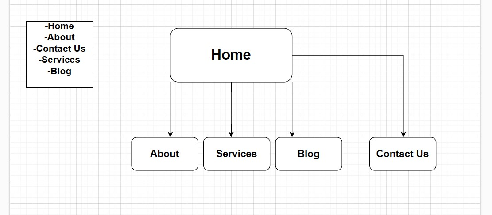

# Website portfolio

## Overview
This is a portfolio website creating a mock up of my services.
This currently under development. 
I will keep adding the features in readme that i will add to the website

## Components

### Header
The header component has a logo and name of the company along with the navigation bar. The navigation bar has links to navigate to different pages.

### Footer
The footer component now has all social media links and the information of the company.

### Main
The main component which included the feature image and write up of the company.

## Pages

### Home
The home page displays the feature image with text needing a redo

### Services 
The services page has been complete with images and text

### About
The About page uses css grid to show some information about the company.

### Contact
The contact page has a form to fill up to contact the company but submit button doesnt work

### Blog
The Blog page has been complete along with images and recent post list

### Final Finishing Touches
All finidhing touches have now been complete 

# Information and links for assignment

## A link (URL) to your published portfolio website
https://deanboric-t1a2-portfolio.netlify.app/

## A link to your GitHub repo
https://github.com/insearchwhy/T1A2-Portfolio

## Description of your portfolio website, including,

## Purpose
To create a website presenting me as a dev and IT proffesional.

## Functionality / features
Added flexbox and grid! Links externally interally etc

## Screenshots

## Sitemap

## Target audience
People wanting to engage a web developer

## Tech stack (e.g. html, css, deployment platform, etc)
Included Html CSS netlify and github